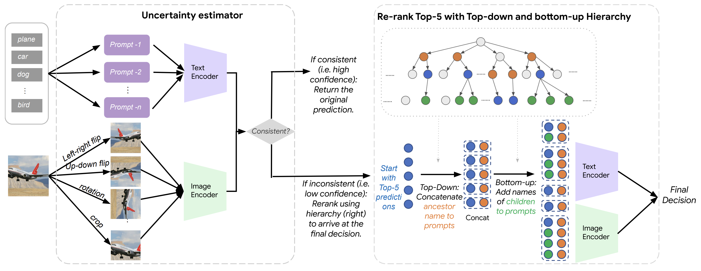
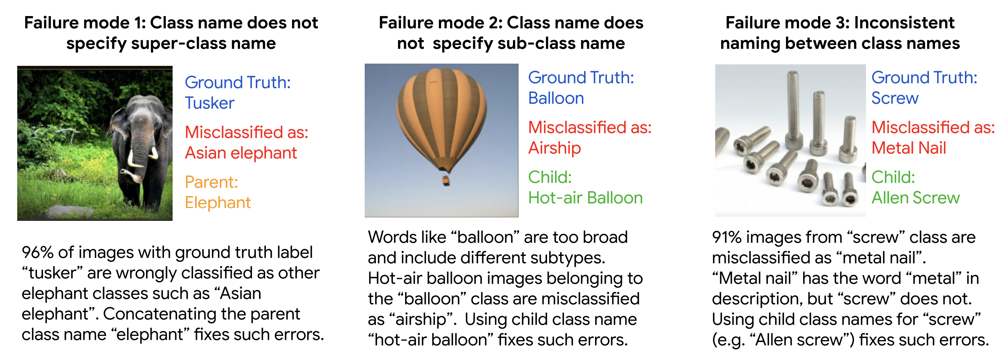

# Hierarchy-CLIP
[CVPR 2023] Improving Zero-shot Generalization and Robustness of Multi-modal Models

> **Improving Zero-shot Generalization and Robustness of Multi-modal Models** <br>
> [Yunhao Ge*](https://gyhandy.github.io/),  [Jie Ren*](https://jessieren.github.io/)*, [Andrew Gallagher](https://scholar.google.com/citations?hl=en&user=-RFj-kYAAAAJ&view_op=list_works&sortby=pubdate),
[Yuxiao Wang](https://www.linkedin.com/in/yuxiaow/), [Ming-Hsuan Yang](http://faculty.ucmerced.edu/mhyang/), [Hartwig Adam](https://scholar.google.com/citations?user=fWd88tEAAAAJ&hl=en), 
[Laurent Itti](https://scholar.google.com/citations?user=xhUvqK8AAAAJ&hl=en), [Balaji Lakshminarayanan](http://www.gatsby.ucl.ac.uk/~balaji/), [Jiaping Zhao](https://scholar.google.com/citations?user=j64_S3EAAAAJ&hl=en) ( * =equal contribution) <br>
> *IEEE/ CVF International Conference on Computer Vision and Pattern Recognition (CVPR), 2023*


### [Project Page](https://sites.google.com/usc.edu/hierarchy-clip/) | [Video](https://www.youtube.com/watch?v=6nirYCh2xA0) | [Paper](https://openaccess.thecvf.com/content/CVPR2023/papers/Ge_Improving_Zero-Shot_Generalization_and_Robustness_of_Multi-Modal_Models_CVPR_2023_paper.pdf)


<div align="center">
    
</div>

**Figure:** *Our zero-shot classification pipeline consists of 2 steps: confidence estimation via self-consistency (left block) and top-down and
bottom-up label augmentation using the WordNet hierarchy (right block).*


<div align="center">
    
</div>

**Figure:** *Typical failure modes in the cases where top-5 prediction was correct but top-1 was wrong.*


## Getting Started

### Installation

- Clone this repo:
```bash
git clone https://github.com/gyhandy/Hierarchy-CLIP.git
cd Hierarchy-CLIP
```

### Colab
We provide a colab code
```bash
Hierarcy_Clip.ipynb
```


## Contact / Cite
Got Questions? We would love to answer them! Please reach out by email! You may cite us in your research as:
```
@inproceedings{ge2023improving,
  title={Improving Zero-shot Generalization and Robustness of Multi-modal Models},
  author={Ge, Yunhao and Ren, Jie and Gallagher, Andrew and Wang, Yuxiao and Yang, Ming-Hsuan and Adam, Hartwig and Itti, Laurent and Lakshminarayanan, Balaji and Zhao, Jiaping},
  booktitle={Proceedings of the IEEE/CVF Conference on Computer Vision and Pattern Recognition},
  pages={11093--11101},
  year={2023}
}
```